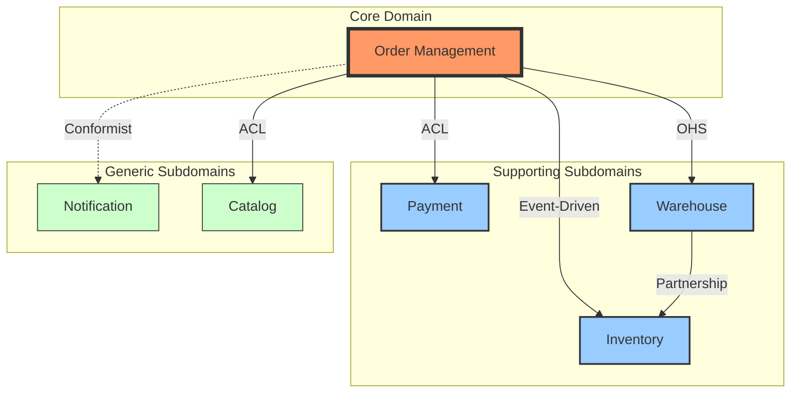

# DDD Strategic Design Output Templates

本文件提供三種核心 DDD 戰略設計產出物的標準格式和範例。

---

## 1. Bounded Context Analysis

### 目的
記錄每個 Bounded Context 的職責、邊界、以及與其他 Context 的關係。

### 格式

```markdown
# Bounded Context: [Context 名稱]

## 概述
[1-2 段描述這個 Context 的核心職責和存在理由]

## 業務能力
- [此 Context 提供的核心業務能力 1]
- [此 Context 提供的核心業務能力 2]
- [此 Context 提供的核心業務能力 3]

## 領域分類
- **類型**: Core Domain / Supporting Subdomain / Generic Subdomain
- **戰略重要性**: High / Medium / Low
- **複雜度**: High / Medium / Low

## Ubiquitous Language (核心術語)
| 術語 | 定義 | 備註 |
|------|------|------|
| [術語 1] | [在此 Context 中的精確定義] | [與其他 Context 的差異或特殊說明] |
| [術語 2] | [在此 Context 中的精確定義] | [與其他 Context 的差異或特殊說明] |

## 核心實體與聚合
- **[聚合名稱 1]**: [簡述聚合根和主要實體]
- **[聚合名稱 2]**: [簡述聚合根和主要實體]

## 關鍵領域事件
- [領域事件 1]: [發生時機和意義]
- [領域事件 2]: [發生時機和意義]

## 邊界與職責
### 包含的職責
- [明確屬於此 Context 的職責 1]
- [明確屬於此 Context 的職責 2]

### 排除的職責 (不負責)
- [明確不屬於此 Context 的職責 1]
- [明確不屬於此 Context 的職責 2]

## 對外整合點
| 整合對象 | 整合方式 | 資料流向 | 說明 |
|----------|----------|----------|------|
| [其他 Context] | [ACL/OHS/etc] | [雙向/單向] | [整合目的和內容] |

## 團隊與所有權
- **負責團隊**: [團隊名稱]
- **主要聯絡人**: [姓名/角色]
- **決策權**: [此 Context 的設計決策由誰負責]

## 技術考量
- **主要技術棧**: [程式語言、框架]
- **資料儲存**: [資料庫類型]
- **部署方式**: [獨立服務 / 模組 / 函式庫]

## 演化歷史與未來規劃
- **當前狀態**: [現況描述]
- **已知問題**: [技術債或設計問題]
- **未來規劃**: [預期的變化或改善方向]
```

### 範例

```markdown
# Bounded Context: Order Management (訂單管理)

## 概述
Order Management Context 負責處理客戶訂單的完整生命週期，從訂單建立、驗證、到履行協調。這是電商平台的核心 Context，直接影響營收和客戶體驗。

## 業務能力
- 接收和驗證客戶訂單
- 計算訂單總價 (含稅、折扣、運費)
- 協調庫存預留和付款處理
- 追蹤訂單狀態和進度
- 處理訂單修改和取消

## 領域分類
- **類型**: Core Domain
- **戰略重要性**: High
- **複雜度**: High

## Ubiquitous Language (核心術語)
| 術語 | 定義 | 備註 |
|------|------|------|
| Order (訂單) | 客戶購買意圖的正式記錄，包含商品、數量、價格和配送資訊 | 不同於 Cart (購物車)，Order 代表已承諾的交易 |
| Order Line (訂單項目) | 訂單中的單一商品項目，包含 SKU、數量、單價 | 可獨立取消或退貨 |
| Order Status (訂單狀態) | 訂單當前所處的階段 | 可能的值: Pending, Confirmed, Shipped, Delivered, Cancelled |
| Fulfillment (履行) | 完成訂單的實體流程，包含撿貨、包裝、出貨 | 由 Warehouse Context 負責實際執行 |

## 核心實體與聚合
- **Order Aggregate**: Order (聚合根)、OrderLine、ShippingAddress、BillingAddress
- **Pricing Aggregate**: Price、Discount、TaxRate

## 關鍵領域事件
- OrderPlaced: 訂單建立時發布，觸發庫存預留和付款流程
- OrderConfirmed: 付款成功後發布，觸發履行流程
- OrderCancelled: 訂單取消時發布，釋放已預留資源

## 邊界與職責
### 包含的職責
- 訂單資料的完整性和一致性
- 訂單狀態的生命週期管理
- 訂單相關的業務規則驗證
- 訂單事件的發布

### 排除的職責 (不負責)
- 實際的庫存扣減 (由 Inventory Context 負責)
- 付款交易處理 (由 Payment Context 負責)
- 物流配送執行 (由 Warehouse Context 負責)
- 商品資訊維護 (由 Catalog Context 負責)

## 對外整合點
| 整合對象 | 整合方式 | 資料流向 | 說明 |
|----------|----------|----------|------|
| Inventory Context | Event-Driven | 雙向 | 請求庫存預留，接收庫存確認 |
| Payment Context | ACL | 單向 (Order→Payment) | 發起付款請求 |
| Warehouse Context | OHS | 單向 (Order→Warehouse) | 下達履行指令 |
| Catalog Context | ACL | 單向 (Order→Catalog) | 查詢商品資訊和價格 |

## 團隊與所有權
- **負責團隊**: 交易核心團隊 (Transaction Core Team)
- **主要聯絡人**: Alice Chen (Tech Lead)
- **決策權**: 訂單領域模型由交易核心團隊決策，需與產品團隊協調業務需求

## 技術考量
- **主要技術棧**: Java 17, Spring Boot, PostgreSQL
- **資料儲存**: PostgreSQL (交易資料), Redis (快取)
- **部署方式**: 獨立微服務，容器化部署

## 演化歷史與未來規劃
- **當前狀態**: 已上線運行 2 年，穩定支援日均 10 萬筆訂單
- **已知問題**: 訂單修改邏輯過於複雜，有重構需求
- **未來規劃**: 考慮引入 Event Sourcing 來更好地追蹤訂單變更歷史
```

---

## 2. Context Map (上下文映射圖)

### 目的
視覺化展示 Bounded Contexts 之間的關係和整合模式。

### Context Mapping Patterns (關係模式)

#### 團隊協作模式
- **Partnership (夥伴關係)**: 兩個團隊緊密合作，共同演化
- **Shared Kernel (共享核心)**: 兩個 Context 共享部分領域模型
- **Customer-Supplier (客戶-供應商)**: 下游團隊依賴上游團隊提供的介面

#### 獨立演化模式
- **Conformist (遵從者)**: 下游完全接受上游的模型，無議價能力
- **Anticorruption Layer (防腐層 - ACL)**: 下游建立轉換層來隔離上游影響
- **Open Host Service (開放主機服務 - OHS)**: 上游提供標準化的公開 API
- **Published Language (公開語言)**: 使用行業標準格式 (如 JSON Schema)

#### 特殊模式
- **Separate Ways (分道揚鑣)**: 兩個 Context 完全獨立，無整合
- **Big Ball of Mud (大泥球)**: 混亂無邊界的遺留系統

### 文字格式

```markdown
# Context Map: [系統名稱]

## Contexts Overview

### [Context A]
- **類型**: Core Domain
- **團隊**: [團隊名稱]

### [Context B]
- **類型**: Supporting Subdomain
- **團隊**: [團隊名稱]

## Context Relationships

### [Context A] → [Context B]: [關係模式]
- **方向**: A 依賴 B / B 依賴 A / 雙向依賴
- **整合方式**: REST API / Event Bus / Shared Database / RPC
- **資料流**: [什麼資料在兩者間流動]
- **說明**: [為什麼選擇這種關係模式]

### [Context B] ← [Context C]: [關係模式]
- **方向**: ...
- **整合方式**: ...
- **資料流**: ...
- **說明**: ...
```

### 圖形格式 (Mermaid)



### 範例

```markdown
# Context Map: E-Commerce Platform

## Contexts Overview

### Order Management (訂單管理)
- **類型**: Core Domain
- **團隊**: Transaction Core Team
- **職責**: 訂單生命週期管理

### Inventory (庫存管理)
- **類型**: Supporting Subdomain
- **團隊**: Supply Chain Team
- **職責**: 庫存追蹤和預留

### Payment (付款處理)
- **類型**: Supporting Subdomain
- **團隊**: Payment Team
- **職責**: 金流處理和對帳

### Warehouse (倉儲管理)
- **類型**: Supporting Subdomain
- **團隊**: Operations Team
- **職責**: 訂單履行和物流

### Catalog (商品目錄)
- **類型**: Generic Subdomain
- **團隊**: Content Team
- **職責**: 商品資訊管理

### Notification (通知服務)
- **類型**: Generic Subdomain
- **團隊**: Platform Team
- **職責**: 郵件、簡訊、推播通知

## Context Relationships

### Order Management → Inventory: Event-Driven (事件驅動)
- **方向**: 雙向依賴
- **整合方式**: Message Queue (RabbitMQ)
- **資料流**: 
  - Order→Inventory: InventoryReservationRequested 事件
  - Inventory→Order: InventoryReserved / InventoryUnavailable 事件
- **說明**: 使用事件驅動確保庫存預留的非同步處理，避免阻塞訂單建立流程

### Order Management → Payment: Anticorruption Layer (防腐層)
- **方向**: Order 依賴 Payment
- **整合方式**: REST API with ACL
- **資料流**: 付款請求和結果查詢
- **說明**: Payment Context 的模型較複雜且經常變動，使用 ACL 隔離變化，Order Context 內部使用簡化的付款模型

### Order Management → Warehouse: Open Host Service (開放主機服務)
- **方向**: Order 依賴 Warehouse
- **整合方式**: Warehouse 提供標準化 REST API
- **資料流**: 履行指令 (Fulfillment Order)
- **說明**: Warehouse 作為多個上游 Context 的服務提供者，提供穩定的公開介面

### Order Management → Catalog: Anticorruption Layer (防腐層)
- **方向**: Order 依賴 Catalog
- **整合方式**: GraphQL API with ACL
- **資料流**: 商品資訊查詢 (價格、庫存狀態)
- **說明**: Catalog 的資料模型面向內容管理，與 Order 的交易模型不同，使用 ACL 轉換

### Warehouse ↔ Inventory: Partnership (夥伴關係)
- **方向**: 雙向緊密協作
- **整合方式**: Direct API calls + Shared Events
- **資料流**: 實體庫存變動、撿貨確認
- **說明**: 兩個團隊共同負責實體庫存的準確性，需要緊密協作和共同演化

### Order Management → Notification: Conformist (遵從者)
- **方向**: Order 依賴 Notification
- **整合方式**: Event Bus (單向)
- **資料流**: 訂單狀態通知請求
- **說明**: Notification 是通用服務，Order 接受其定義的事件格式，不需要轉換層

## Strategic Decisions

1. **為何 Order 與 Inventory 使用事件驅動？**
   - 庫存預留可能需要等待，不適合同步 API
   - 解耦兩個 Context，允許獨立擴展

2. **為何需要多個 ACL？**
   - Payment 和 Catalog 的模型差異大，直接使用會污染 Order 的領域模型
   - ACL 提供穩定的內部介面，隔離外部變化

3. **Warehouse 為何選擇 OHS？**
   - 多個上游 Context 需要倉儲服務 (Order, Return, Transfer)
   - 標準化介面降低維護成本
```

---

## 3. Ubiquitous Language Glossary (統一語言詞彙表)

### 目的
記錄整個系統或特定 Bounded Context 內的精確術語定義，確保團隊溝通無歧義。

### 格式

```markdown
# Ubiquitous Language: [Context 或系統名稱]

## 如何使用本詞彙表
- **範圍**: 本詞彙表涵蓋 [具體範圍]
- **維護**: 由 [負責人/團隊] 維護
- **更新頻率**: 每當新增或修改術語時立即更新

---

## [分類 1: 例如「核心實體」]

### [術語 1]
- **英文**: [English Term]
- **定義**: [清晰、無歧義的定義]
- **範例**: [實際使用的例子]
- **關聯術語**: [相關的其他術語]
- **注意事項**: [常見誤解或與其他 Context 的差異]

### [術語 2]
- **英文**: [English Term]
- **定義**: ...

## [分類 2: 例如「狀態與生命週期」]

...

## [分類 3: 例如「業務規則與約束」]

...
```

### 範例

```markdown
# Ubiquitous Language: Order Management Context

## 如何使用本詞彙表
- **範圍**: Order Management Bounded Context 內使用的所有領域術語
- **維護**: 由 Transaction Core Team 維護
- **更新頻率**: 每當新增或修改術語時立即更新
- **版本**: v2.3 (2025-10-20)

---

## 核心實體

### Order (訂單)
- **英文**: Order
- **定義**: 客戶向系統提交的購買承諾，包含一個或多個商品項目、配送資訊、和付款資訊。訂單一旦建立，即產生履行義務。
- **範例**: "訂單 #ORD-20251020-00123 包含 3 個訂單項目"
- **關聯術語**: Order Line, Order Status, Fulfillment
- **注意事項**: 
  - 不同於 Cart (購物車): Cart 是暫時的、可隨意修改的，Order 是正式的承諾
  - 不同於 Fulfillment Context 的 "Fulfillment Order": 那是倉儲執行視角，我們的 Order 是交易視角

### Order Line (訂單項目)
- **英文**: Order Line / Line Item
- **定義**: 訂單中的單一商品項目，包含 SKU、數量、單價、和小計。Order Line 是訂單的組成部分,不能獨立存在。
- **範例**: "訂單項目: SKU-12345 × 2,單價 NT$500,小計 NT$1000"
- **關聯術語**: Order, SKU, Quantity
- **注意事項**: 
  - 可以單獨取消或退貨,但仍屬於父訂單
  - 價格在 Order Line 建立時鎖定,不受之後的 Catalog 價格變動影響

### Customer (客戶)
- **英文**: Customer
- **定義**: 在系統中下訂單的自然人或法人。在 Order Context 中,我們只關心客戶的識別 (Customer ID) 和聯絡資訊,不處理客戶資料的完整管理。
- **範例**: "客戶 #CUST-789 下了新訂單"
- **關聯術語**: Order, Shipping Address, Billing Address
- **注意事項**: 
  - 客戶的詳細資料 (會員等級、偏好等) 由 Customer Context 管理
  - 我們只儲存訂單所需的最小客戶資訊副本

---

## 狀態與生命週期

### Order Status (訂單狀態)
- **英文**: Order Status
- **定義**: 訂單在其生命週期中的當前階段。狀態轉換遵循特定的業務規則,不可隨意跳躍。
- **可能的值**:
  - `Pending`: 訂單已建立,等待付款確認
  - `Confirmed`: 付款成功,訂單確認
  - `Preparing`: 倉儲正在準備出貨
  - `Shipped`: 已出貨
  - `Delivered`: 已送達
  - `Cancelled`: 已取消
  - `Refunded`: 已退款
- **範例**: "訂單狀態從 Confirmed 轉換為 Preparing"
- **關聯術語**: Order, Order Lifecycle, Domain Events
- **注意事項**: 
  - 狀態轉換會發布 Domain Events
  - 某些狀態轉換是不可逆的 (如 Delivered → Pending)

### Fulfillment Status (履行狀態)
- **英文**: Fulfillment Status
- **定義**: 訂單的實體履行進度,獨立於 Order Status 追蹤。這是從 Warehouse Context 同步過來的資訊。
- **可能的值**: `NotStarted`, `InProgress`, `Completed`, `Failed`
- **範例**: "訂單的履行狀態為 InProgress"
- **關聯術語**: Order Status, Warehouse Context
- **注意事項**: 
  - Fulfillment Status 由 Warehouse 控制,我們只讀取
  - Order Status 和 Fulfillment Status 不一定同步更新

---

## 業務規則與約束

### Order Modification Window (訂單修改時間窗)
- **英文**: Order Modification Window
- **定義**: 訂單確認後,客戶可以修改訂單內容的時間限制。超過此時間窗後,修改需要更複雜的流程。
- **規則**: 訂單確認後 30 分鐘內可自由修改,超過後需客服介入
- **範例**: "此訂單已超過修改時間窗,無法自動修改"
- **關聯術語**: Order Status, Order Confirmed
- **注意事項**: 修改時間窗不適用於取消操作,取消有獨立的規則

### Minimum Order Amount (最低訂單金額)
- **英文**: Minimum Order Amount / MOA
- **定義**: 系統接受的訂單總額下限。低於此金額的訂單無法提交。
- **規則**: 一般客戶最低 NT$100,VIP 客戶無限制
- **範例**: "訂單金額 NT$80 低於最低訂單金額,無法提交"
- **關聯術語**: Order Total, Customer Type
- **注意事項**: 不含運費和手續費

### Inventory Reservation Timeout (庫存預留逾時)
- **英文**: Inventory Reservation Timeout
- **定義**: 訂單建立後,系統為其預留庫存的有效時間。超時後,如果訂單仍未付款,預留將被釋放。
- **規則**: 預留時間為 15 分鐘
- **範例**: "訂單 #ORD-123 的庫存預留已逾時"
- **關聯術語**: Order Status, Inventory Context
- **注意事項**: 逾時後訂單狀態變為 Expired,客戶需要重新下單

---

## 領域事件

### OrderPlaced
- **英文**: Order Placed Event
- **定義**: 當客戶成功提交訂單時發布的事件。這是訂單生命週期的起點。
- **觸發時機**: Order 聚合建立並持久化後
- **包含資料**: Order ID, Customer ID, Order Lines, Total Amount, Timestamp
- **訂閱者**: Inventory Context (庫存預留), Payment Context (發起付款), Notification Context (發送確認信)
- **範例**: `OrderPlaced { orderId: "ORD-123", customerId: "CUST-789", totalAmount: 1500 }`

### OrderConfirmed
- **英文**: Order Confirmed Event
- **定義**: 當訂單付款成功,訂單正式確認時發布的事件。
- **觸發時機**: Payment Context 通知付款成功,Order 狀態更新為 Confirmed 後
- **包含資料**: Order ID, Payment ID, Confirmed At
- **訂閱者**: Warehouse Context (開始履行), Notification Context (通知客戶)
- **範例**: `OrderConfirmed { orderId: "ORD-123", paymentId: "PAY-456", confirmedAt: "2025-10-20T10:30:00Z" }`

### OrderCancelled
- **英文**: Order Cancelled Event
- **定義**: 當訂單被取消時發布的事件,無論是客戶主動取消或系統取消。
- **觸發時機**: Order 狀態更新為 Cancelled 後
- **包含資料**: Order ID, Cancellation Reason, Cancelled By, Cancelled At
- **訂閱者**: Inventory Context (釋放預留), Payment Context (退款處理), Notification Context (通知客戶)
- **範例**: `OrderCancelled { orderId: "ORD-123", reason: "Customer Request", cancelledBy: "CUST-789" }`

---

## 值物件 (Value Objects)

### Money (金額)
- **英文**: Money
- **定義**: 表示貨幣金額的值物件,包含數值和幣別。
- **屬性**: `amount` (Decimal), `currency` (String, ISO 4217 code)
- **範例**: `Money { amount: 1500.00, currency: "TWD" }`
- **注意事項**: 
  - 金額計算必須考慮精度,使用 Decimal 而非 Float
  - 不同幣別不可直接相加,需要匯率轉換

### Address (地址)
- **英文**: Address
- **定義**: 表示實體地址的值物件,用於配送和帳單地址。
- **屬性**: 
  - `recipientName`: 收件人姓名
  - `phone`: 聯絡電話
  - `postalCode`: 郵遞區號
  - `city`: 城市
  - `district`: 區域
  - `street`: 街道地址
  - `details`: 詳細資訊 (樓層、門牌等)
- **範例**: 
  ```
  Address {
    recipientName: "張小明",
    phone: "0912-345-678",
    postalCode: "100",
    city: "台北市",
    district: "中正區",
    street: "重慶南路一段 122 號",
    details: "3 樓"
  }
  ```
- **注意事項**: 
  - Address 是 immutable,任何修改都會產生新的 Address 實例
  - 驗證邏輯包含郵遞區號和城市的一致性檢查

---

## 跨 Context 術語對照

某些術語在不同 Context 中有不同含義,需要特別注意:

| Order Context | Inventory Context | 說明 |
|---------------|-------------------|------|
| Order | Reservation Request | Order 觸發庫存預留請求 |
| Order Line | Reserved Item | 每個 Order Line 對應一筆庫存預留 |
| Confirmed | Committed | Order 確認對應庫存的正式扣減 |

| Order Context | Warehouse Context | 說明 |
|---------------|-------------------|------|
| Order | Fulfillment Order | 訂單轉為履行指令 |
| Shipped | Out for Delivery | 狀態名稱不同但意義相近 |

| Order Context | Payment Context | 說明 |
|---------------|-------------------|------|
| Order Total | Payment Amount | 金額概念相同,但 Payment 還包含手續費 |
| Order Confirmed | Payment Captured | 確認時機相同,視角不同 |

---

## 版本歷史

- **v2.3 (2025-10-20)**: 新增 Fulfillment Status,澄清與 Order Status 的差異
- **v2.2 (2025-09-15)**: 修正 Order Modification Window 規則,從 15 分鐘調整為 30 分鐘
- **v2.1 (2025-08-01)**: 新增跨 Context 術語對照表
- **v2.0 (2025-06-01)**: 重大改版,引入 Domain Events 章節
- **v1.0 (2025-01-01)**: 初版發布
```

---

## 產出物使用指南

### 何時產出這些文件？

1. **Bounded Context Analysis**: 
   - 當識別出新的 Context 時
   - 當 Context 職責有重大變化時
   - 作為新團隊成員的 onboarding 材料

2. **Context Map**: 
   - 系統架構設計階段
   - 規劃跨團隊協作時
   - 重構或服務拆分時
   - 定期 review (建議每季更新)

3. **Ubiquitous Language**: 
   - 項目啟動時建立初版
   - 持續更新,任何術語變更都要記錄
   - 用於解決團隊溝通誤解時

### 文件維護原則

- **Single Source of Truth**: 每個 Context 的分析文件由該 Context 的負責團隊維護
- **Version Control**: 所有文件應納入版本控制,重大變更要有 changelog
- **Living Documentation**: 這些不是一次性產出,要隨著系統演化持續更新
- **Accessibility**: 確保所有相關人員都能輕易存取這些文件

### 輸出格式建議

- **Markdown**: 適合納入版本控制,易於協作編輯
- **Confluence/Notion**: 適合需要豐富排版和快速分享
- **Mermaid/PlantUML**: Context Map 的圖形化表達
- **ADR (Architecture Decision Records)**: 記錄重要的設計決策和權衡
