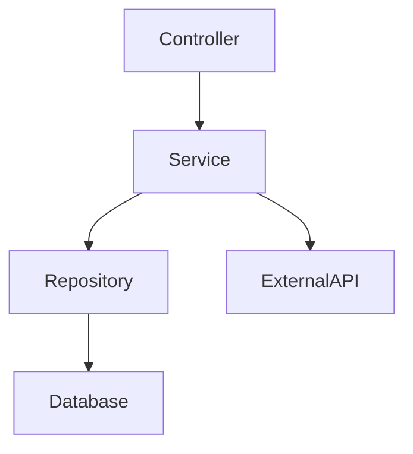

# 逆向工程：從實作推導設計

從現有程式碼逆向分析並生成技術設計文件：**$ARGUMENTS**

## 逆向分析流程概述

**ORIK** 是從既有實作逆向推導出設計和需求的流程：
- 階段 1：**實作 → 設計** (ngised-ceps)
- 階段 2：**設計 → 需求** (stnemeriuqer-ceps)

## 任務：分析實作並推導設計

### 1. 程式碼探索和理解

#### 1.1 識別程式碼範圍
根據 **$ARGUMENTS** 確定要分析的範圍：
- 如果是功能路徑：分析該路徑下的所有相關檔案
- 如果是模組名稱：追蹤模組的所有元件和相依性
- 如果是 API 端點：從端點追蹤到所有相關層級

#### 1.2 程式碼結構分析
探索並記錄：
```
程式碼基礎結構
├── 檔案組織模式
├── 目錄結構意圖
├── 命名慣例
└── 模組邊界
```

#### 1.3 技術堆疊識別
自動偵測：
- 程式語言和版本
- 使用的框架和函式庫
- 資料庫技術
- 外部服務整合
- 建置和部署工具

### 2. 架構逆向工程

#### 2.1 架構模式識別
分析並識別：
- **結構模式**：MVC、分層架構、微服務、單體式
- **行為模式**：觀察者、策略、工廠、單例
- **整合模式**：API Gateway、Message Queue、Event Bus

#### 2.2 元件關係分析
建立元件依賴圖：


#### 2.3 資料流追蹤
從入口點追蹤資料流動：
1. HTTP 請求入口
2. 中介層處理
3. 業務邏輯執行
4. 資料存取層
5. 回應生成

### 3. API 和介面分析

#### 3.1 API 端點提取
掃描並記錄所有 API 端點：
```bash
# 搜尋路由定義
grep -r "Route\|route\|@app\|@router" --include="*.py" --include="*.js" --include="*.php"

# 搜尋控制器方法
grep -r "def.*Controller\|function.*Action" --include="*.py" --include="*.php"
```

#### 3.2 介面契約推導
從實作推導介面定義：
- 請求參數和驗證規則
- 回應格式和狀態碼
- 錯誤處理模式
- 認證和授權需求

### 4. 資料模型逆向工程

#### 4.1 實體識別
從程式碼提取領域實體：
```bash
# 搜尋模型定義
grep -r "class.*Model\|@Entity\|Schema\|Table" --include="*.py" --include="*.php" --include="*.js"

# 搜尋資料庫遷移
find . -path "*/migrations/*" -o -path "*/schema/*"
```

#### 4.2 關係推導
分析實體間關係：
- 一對一、一對多、多對多
- 外鍵約束
- 級聯規則
- 索引策略

#### 4.3 業務規則提取
從驗證和約束推導規則：
- 欄位驗證規則
- 唯一性約束
- 業務邏輯約束
- 計算欄位邏輯

### 5. 設計文件生成

根據分析結果生成 `.orik/reverse/$ARGUMENTS/design.md`：

```markdown
# 逆向工程技術設計

## 分析元資料
- 分析日期：[當前日期]
- 分析範圍：$ARGUMENTS
- 程式碼行數：[統計]
- 檔案數量：[統計]

## 概覽
[從程式碼推導的系統概述]

## 架構
[識別的架構模式和結構]

### 技術堆疊（推導）
- **語言**：[偵測結果]
- **框架**：[偵測結果]
- **資料庫**：[偵測結果]
- **相依套件**：[從 package.json/requirements.txt/composer.json 提取]

### 架構決策推論
[從實作模式推導可能的架構決策原因]

## 資料流
[追蹤的資料流程圖]

## 元件和介面

### 識別的服務
[從程式碼提取的服務列表和方法]

### API 端點（發現）
| 方法 | 路由 | 推測用途 | 參數 | 回應 |
|------|------|----------|------|------|
| [提取的端點資料] |

## 資料模型

### 領域實體（推導）
[從模型檔案提取的實體]

### 實體關係（分析）
[從關聯定義推導的 ER 圖]

## 錯誤處理模式
[從 try-catch 和錯誤處理程式碼分析]

## 安全實作（觀察）
[從程式碼識別的安全措施]

## 測試覆蓋（如果存在）
[從測試檔案分析測試策略]

## 推導的設計模式
[識別的設計模式和最佳實踐]

## 技術債務和改進建議
[發現的潛在問題和優化機會]
```

### 6. 生成追蹤元資料

建立 `.orik/reverse/$ARGUMENTS/analysis.json`：
```json
{
  "analysis_type": "implementation_to_design",
  "timestamp": "當前時間戳記",
  "scope": "$ARGUMENTS",
  "files_analyzed": [],
  "patterns_identified": [],
  "dependencies_found": [],
  "next_phase": "stnemeriuqer-ceps",
  "confidence_level": "high|medium|low",
  "gaps_identified": []
}
```

### 7. 分析報告生成

生成分析摘要給使用者：
```
📊 逆向工程分析完成
━━━━━━━━━━━━━━━━━━━━━━━━━━━━━━━━━━━━━━━━
📁 分析範圍：$ARGUMENTS
📈 分析檔案：[數量] 個檔案
🔍 識別模式：[列出主要架構模式]
🎯 置信度：[高/中/低]

✅ 已生成：
  • 設計文件：.orik/reverse/$ARGUMENTS/design.md
  • 分析資料：.orik/reverse/$ARGUMENTS/analysis.json

🔜 下一步：
  執行 /orik:stnemeriuqer-ceps $ARGUMENTS 
  從設計推導需求和規格
```

## 分析技巧

### 搜尋模式庫
```bash
# Laravel/PHP
"Route::|class.*Controller|function.*Action|Schema::|DB::"

# Python/FastAPI
"@app\.|@router\.|class.*Model|def.*endpoint|async def"

# Node.js/Express
"router\.|app\.|module\.exports|const.*Schema|mongoose\."

# Spring Boot
"@RestController|@RequestMapping|@Entity|@Repository"
```

### 自動化分析工具整合
- 使用 AST（抽象語法樹）分析
- 呼叫靜態分析工具
- 整合相依性分析工具
- 利用程式碼複雜度分析

## 注意事項

1. **保持客觀**：只記錄觀察到的，避免過度推測
2. **標記不確定性**：明確標示推導和假設
3. **完整性檢查**：確保沒有遺漏重要元件
4. **版本意識**：注意程式碼可能混合不同時期的實作
5. **隱藏邏輯**：注意設定檔、環境變數等外部配置

## 指示

1. **系統性探索** - 從入口點開始，逐層深入
2. **模式識別** - 尋找重複的結構和慣例
3. **關係追蹤** - 建立元件間的依賴圖
4. **完整記錄** - 包含所有發現，即使看似瑣碎
5. **結構化輸出** - 按照設計文件標準格式組織
6. **標記缺口** - 明確指出缺失或不清楚的部分
7. **提供證據** - 每個推論都要有程式碼位置佐證

生成的設計文件將作為下一階段（stnemeriuqer-ceps）的輸入，用於推導原始需求。